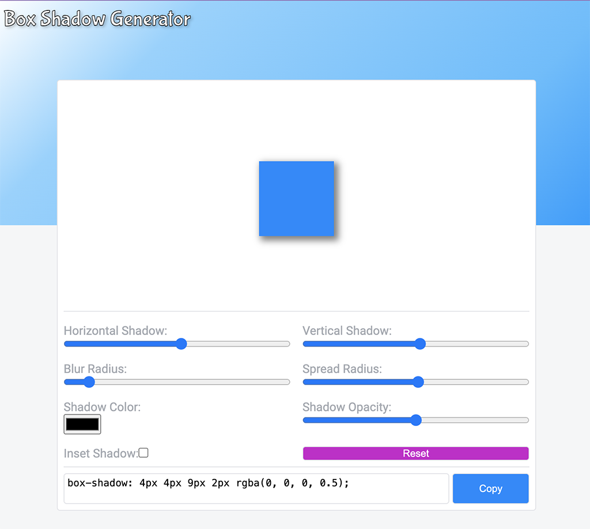

# Box Shadow Generator

The Box Shadow Generator is a simple React project to showcase how you can make a UI on top of CSS properties for box-shadows.
It is also possible to copy the result as plain-text CSS and use in other project.

***

***

## Structure
This is a small project, but used to showcase code structure where there is a clean separation between the data models, the data store (React Context), the data logic and the visual components.

## Running the project
It is possible to clone the project as is and run:
* yarn i (to install all dependencies)
* yarn start
